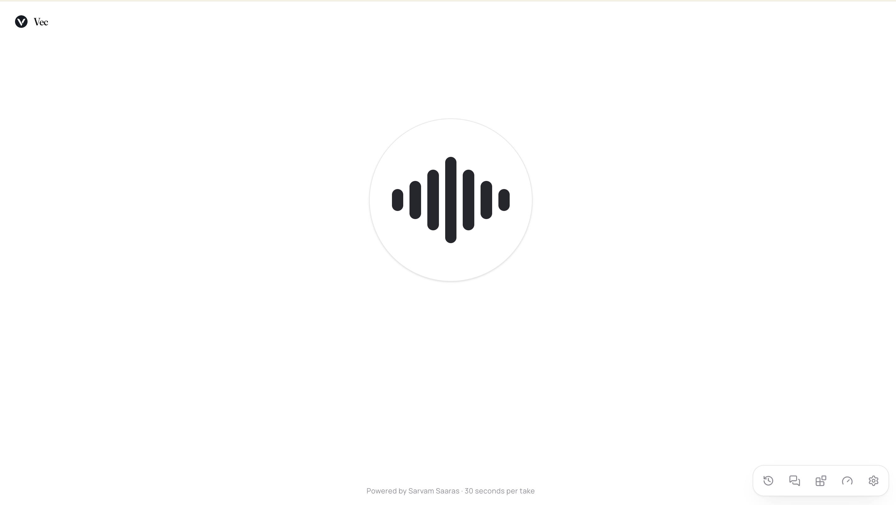
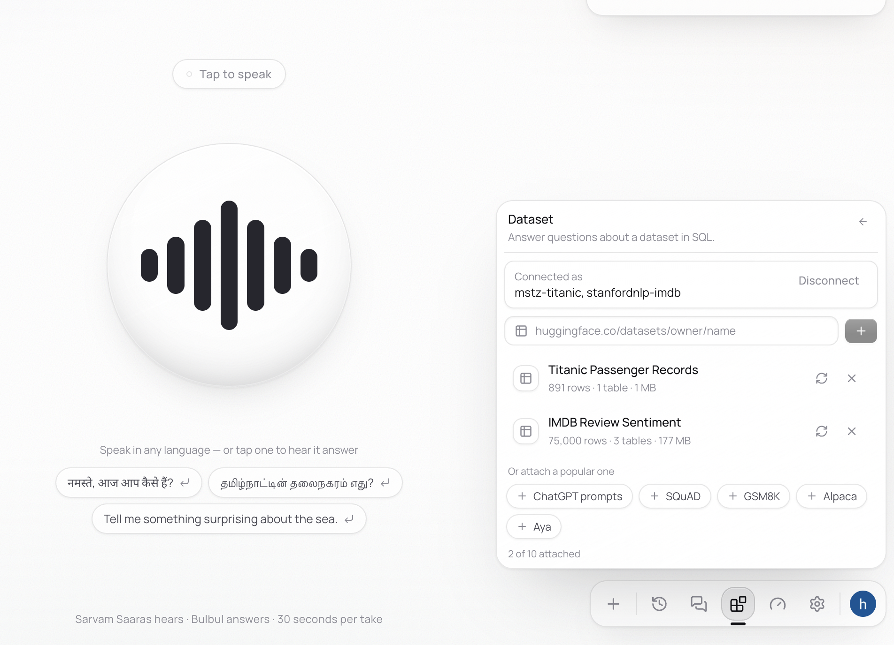
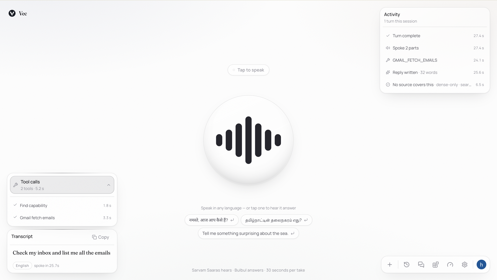

<div align="center">

# Vec

### Speak, and be answered — out loud, in the language you spoke.

Say it in Hindi, Tamil, Kannada — any of twenty-two languages — and hear the answer
back about a second after you stop talking.

[](pyproject.toml)
[](src/main.py)
[](frontend/package.json)
[](https://docs.sarvam.ai/api/api-guides-tutorials/speech-to-text/overview)
[](docs/13-connectors.md)



</div>

---

[Sarvam AI](https://docs.sarvam.ai/api/api-guides-tutorials/speech-to-text/overview) hears
(Saaras) and speaks (Bulbul); the reply is written by OpenAI when its key is present and by
Sarvam when it is not. Every stage streams into the next — the answer is being read aloud
while it is still being written — and talking over it stops it mid-word.
[`docs/11-voice.md`](docs/11-voice.md) is how, and what it measures.

> **Retrieval belongs to whoever asks.** This app holds no corpus: a question is answered
> from the vector store its asker connected — Pinecone, Astra, or their own Postgres — and a
> listener who has attached nothing is answered by the model and the tools they *did*
> connect. There is no switch to turn it on ([`docs/13-connectors.md`](docs/13-connectors.md)).
> It answers questions asked in *any* language, whatever the store was indexed in: the
> embedder is cross-lingual, and where a store is wider than 384 dimensions the query is
> embedded at that store's own width.
> [`docs/13a-cross-lingual.md`](docs/13a-cross-lingual.md) measures what that costs.

Connecting is what turns that into leverage. A vector store makes your own passages
answerable out loud; a pasted dataset URL makes rows nobody embedded answerable in SQL; a
linked Gmail or Slack makes a spoken sentence *do* something. And the agent is never handed a
list of what you have — it holds one discovery tool and goes looking, so the prompt grows
with the question rather than with the account.
[**What a question can reach**](#connectors-what-a-question-can-reach) is that flow, end to
end.

> [!NOTE]
> One caveat before the latency numbers below. The 200 ms budget in
> [`docs/04-latency.md`](docs/04-latency.md) was measured against an in-process index. Over
> a Neon instance 66 ms of round trip away, a full answered query measures **221 ms** —
> close, and not inside. An abstention, which stops at the search, is 87 ms.

## Contents

- [Quickstart](#quickstart) — two keys, no index, no Docker
- [The spoken loop](#the-spoken-loop) — what happens between the tap and the sound
- [Conversations, and what carries between them](#conversations-and-what-carries-between-them)
- [Connectors: what a question can reach](#connectors-what-a-question-can-reach) — your store, your datasets, your tools, and how the agent finds them
- [The effort ladder](#the-effort-ladder) — five retrieval architectures on one slider
- [API surface](#api-surface)
- [Repo layout](#repo-layout)
- [Constraints worth knowing](#constraints-worth-knowing)
- [Design docs](#design-docs)

## Quickstart

### Backend

One key, no index, no Docker:

```bash
cp .env.example .env              # paste SARVAM_API_KEY from dashboard.sarvam.ai
uv run python -m src.main         # http://127.0.0.1:8001/health
```

Without uv, the same set installs from pip: `pip install -r requirements.txt`
(`requirements-dev.txt` adds the test deps). Both are pinned exports of `uv.lock` — the lock
stays the source of truth, so bump a version in `pyproject.toml`, `uv lock`, then re-export;
the header of each file carries the exact command.

Boot loads the ONNX embedding session before it accepts traffic, which is a few seconds and
the reason the first question is not the one that pays for it. Add `OPENAI_API_KEY` to have
OpenAI write the replies and cover the languages Bulbul does not speak.

There is no index to build. This app holds no corpus of its own: a question is answered from
the vector store its asker connected, and a user with nothing attached is told so rather
than answered from somewhere else. See [`docs/13-connectors.md`](docs/13-connectors.md).

`DATABASE_URL` is what this app stores its *own* data in — conversations, connected accounts
and their profiles, datasets — and is never searched. Set it and
`uv run python -m scripts.migrate` creates every table in a second. Leave it unset and the
voice loop runs exactly as before; the URL just never gains a `/c/…` and nothing is written
down.

### Frontend

```bash
cd frontend
cp .env.example .env.local
npm install
npm run dev                       # http://localhost:3002
```

The browser opens the FastAPI socket directly — a Next route handler speaks
request/response, and a spoken turn is a two-way stream with an interrupt. No key is exposed
by that: Sarvam and OpenAI are only ever called from the Python side.

<details>
<summary><b>Connecting a vector store</b></summary>

<br>

Retrieval reads whatever the signed-in user attached in the connectors panel — a Pinecone
index, an Astra collection, or a Postgres with `pgvector`. Nothing is ingested here and no
schema is imposed: `verify` finds the table, reads its columns, and the search SQL is built
from what it found ([`src/rag/columns.py`](src/rag/columns.py)), so a table holding `id` and
`chunk_text` is searchable without being a copy of anything.

A local Postgres to attach, if you want one:

```bash
docker run -d --name vec-pg -p 5432:5432 -e POSTGRES_PASSWORD=vec \
  -e POSTGRES_USER=vec -e POSTGRES_DB=vec pgvector/pgvector:pg17
```

```bash
uv run python -m scripts.migrate    # this app's own tables; check the DSN and round trip
# then attach it as a pgvector connector and it is searched from the next question
```

Gate 2's threshold pairs in `.env` were swept against one corpus and are not a property of
whatever you connect. If recall looks thin on a connected store, `RETRIEVAL_FLOOR` and
`RETRIEVAL_MARGIN` are the first dials to re-check
([`docs/06-guardrails.md`](docs/06-guardrails.md)).

</details>

## The spoken loop

Tap the orb — or press space — and talk. It closes the take itself when you stop, sends what
it heard to Saaras, writes a reply in your language, and starts speaking before the reply is
finished. Tap again while it talks and it stops mid-word.

```
mic ─► Saaras ─► transcript ─► chat model ─┬─► text on screen
                                           └─► segmenter ─► Bulbul ─► PCM ─► speakers
```

Measured in Hindi, from the end of the take — with the reply still being written 300 ms
after the speakers start:

| Stage | From end of take |
| --- | --- |
| Transcript back from Saaras | 841 ms |
| First token of the reply | 1,072 ms |
| **First audio out of the speakers** | **1,879 ms** |

Full table in [`docs/11-voice.md`](docs/11-voice.md).

| Piece | File |
| --- | --- |
| Mic, socket, playback, barge-in | [`frontend/src/hooks/use-voice-session.ts`](frontend/src/hooks/use-voice-session.ts) |
| Streaming PCM player | [`frontend/src/lib/pcm-player.ts`](frontend/src/lib/pcm-player.ts) |
| The turn, end to end | [`src/services/voice_service.py`](src/services/voice_service.py) |
| Hearing, replying, speaking | [`src/voice/`](src/voice/) |
| Where a reply gets cut for speech | [`src/voice/segment.py`](src/voice/segment.py) |
| The wire contract | [`src/schemas/voice.py`](src/schemas/voice.py) ↔ [`voice-protocol.ts`](frontend/src/lib/voice-protocol.ts) |

## Conversations, and what carries between them

The first thing you say opens a conversation: the address bar becomes `/c/conv_…` while the
reply is still being written, and every turn after it is saved there. Reload that URL and the
model picks up where it left off — it is handed its own history back out of Postgres before
the socket is ready. The History panel lists the rest of them.

Signed out, they belong to the browser. Sign in with Clerk and they follow the account
instead — including everything said before, claimed in one statement at sign-in — so the same
conversations are there on the next device. Identity is always a **verified Clerk token**, on
the socket as well as over HTTP; there is no user id header to type.
[`docs/12-conversations.md`](docs/12-conversations.md) is how, and what is stored for a turn
you talked over.

A reloaded conversation gets its own words back; a **new** one used to start from nothing.
Now it does not. Every turn is also mirrored into [Redis Agent
Memory](https://redis.io/docs/latest/operate/rc/context-engine/agent-memory/), which distils
durable facts out of them in the background — *the user is vegetarian*, *they prefer being
answered in Tamil* — and the next conversation opens having searched them. Postgres stays the
source of truth for what was **said**; this is what was **learned**. It is scoped to one
person, capped at three facts, floored on similarity, run beside retrieval rather than before
it, and told in the prompt never to recite itself — because a remembered fact is asserted in
the model's opening sentence, which is the worst place to be wrong. Unconfigured, the agent
simply forgets between conversations and nothing else changes.
[`docs/16-memory.md`](docs/16-memory.md) is how, including how it and the answer cache share
one 30 MB instance without evicting each other.

| Piece | File |
| --- | --- |
| Conversations, saved and reloadable | [`src/chat/store.py`](src/chat/store.py), [`docs/12-conversations.md`](docs/12-conversations.md) |
| What the agent remembers between conversations | [`src/memory/store.py`](src/memory/store.py), [`docs/16-memory.md`](docs/16-memory.md) |
| The answer cache, in Redis | [`src/rag/cache.py`](src/rag/cache.py) |

## Connectors: what a question can reach

With nothing attached, Vec is a voice loop over a model — it hears twenty-two languages,
answers in the one it heard, and says *"I don't have a source to search yet"* rather than
inventing one. Attaching something does not change how any of that sounds. It changes what a
question is allowed to **reach**.

Signing in unlocks the Connectors panel, and every credential in it is **yours**. None are
baked into this server, everything runs inside your own project, and two people share no
connector state at all.

| You attach | With | And a spoken question can then |
| --- | --- | --- |
| **Pinecone**, **Astra**, or your own **Postgres + pgvector** | your key, your index | be answered out of passages from *your* index — asked in any of the 22 languages, whatever the index was written in |
| **A dataset** — a HuggingFace repo, or any `.parquet` / `.csv` URL | paste the URL | be answered in **SQL** — counts, `GROUP BY`, averages over rows nobody embedded |
| **Gmail, Slack, Notion, GitHub…** | your own Composio project | be *carried out* — fetch the inbox, open the issue, send the message |

Those are not three flavours of retrieval. One looks things up, one computes, one has effects
outside this app — and a single turn picks whichever fits, chosen by the question rather than
by a setting.

<div align="center">

</div>

### Two clocks

Understanding a connected thing is slow — a network pull, a measurement, a model call.
Answering has to be fast, because somebody is listening through it. So the expensive half
runs **once, on a worker thread, off every request path**, and every turn afterwards reads a
row that is already there.

```
ATTACH TIME — once, and nothing waits for it
  PUT /connectors/{slug} {values}
        │
        ├─ clean    drop undeclared keys, insist on required ones
        ├─ verify   ONE real authenticated call — a wrong key is caught at the form
        ├─ seal     Fernet over the whole credential set, master key never in the DB
        └─ store    ──► 200, the form goes green
                     │
                     └─ schedule() ─────────────────────────────► worker thread
                            │
                probe ──────┴────── narrate ────────── derive
          sample the real store   one LLM call over    coverage → what a
          (200 records, bounded)   the excerpts        query may actually do
                            │
                            ▼
                    connector_profiles / agent_datasets
────────────────────────────┼──────────────────────────────────────────────────
TURN TIME — inside a question somebody is waiting through
                            ▼
              Capability(id, what it is good for, the exact call to make)
```

The probe is what makes everything above it honest. It reports, per metadata key, **what
share of records actually carry it** — because *"the index has a `strategy` key"* and *"every
record has one"* look identical if all you ask is whether you ever saw it, and a filter built
on the first is a narrowing the effort ladder believes it applied and never got. A model
writes the prose; only the measurement is allowed to decide what a query may contain
([`docs/17-understanding.md`](docs/17-understanding.md)).

An absent column is a **lost capability, never a substituted one**: no `tsv` means the
keyword channel is off and rung 2 is told so before it asks, rather than a predicate quietly
defaulted to match everything.

### The agent goes and looks

Everything you connected used to be described in the system prompt of *every* turn — a card
per store, plus the OpenAI schema for every action in every linked toolkit. That grew with
the account instead of with the question, it was a menu the model happily answered *from*
(cards carry real numbers, and a model handed one recites it), and with two stores attached
it could not choose between them anyway.

Now the agent opens holding **one** tool and goes and looks:

```
  "check my inbox and list me all the emails"
              │
              ▼
    find_capability("check my inbox")          ← the only schema in round 1
              │
              ▼
    semantic search over what THIS person connected
    (title, summary, topics, what each is good for — embedded locally)
              │
              ▼
    gmail — "use the GMAIL_* tool the answer names"
              │
              ├──► GMAIL_FETCH_EMAILS(...)     ← unlocked by that discovery, and only gmail
              │
              ▼
    the reply, streamed into Bulbul while it is still being written
```

<div align="center">

</div>

That screenshot is the whole flow, measured: **find capability 1.8 s, `GMAIL_FETCH_EMAILS`
3.3 s, 5.2 s of tool time**, then a 32-word reply spoken in two parts. The same shape answers
the other two kinds — the only thing that differs is what discovery names:

| Asked | Discovery returns | The agent then calls |
| --- | --- | --- |
| *"check my inbox"* | `gmail` — a toolkit | `GMAIL_FETCH_EMAILS` |
| *"how many students are enrolled?"* | `pgvector` — *student records* | `search_store(store="pgvector", …)` |
| *"average marks by class"* | `marks` — a dataset | `query_dataset(dataset="marks", …)` |

Four rules hold it together, and they are the reason this is not just prompt-stuffing with
extra steps:

- **Discovery returns instructions, never data.** A match is an id, what it is good for, and
  the call to make next — never a count, never a row. The agent still has to make that call,
  which is what stops a description being mistaken for an answer.
- **Nothing is unlocked until it is relevant.** Round 1 offers one schema. `search_store`,
  `query_dataset` and a toolkit's actions appear only once a discovery has named them, and
  only the toolkit that was named. Unlocking is per turn and forward-only, so a turn cannot
  act on something discovered while answering something else.
- **No discovery, no gate.** If the capability index is off, or profiling is, or a store was
  connected thirty seconds ago and its probe has not finished, the agent gets every tool the
  way it did before any of this existed. Gating a mailbox behind a description of it and then
  not having the description is the one outcome worse than a long prompt.
- **Counts, not names.** What is left in the prompt is `2 connected stores, 1 dataset,
  1 connected account.` — because a name is a hint, and a model given *"you have a students
  dataset"* will answer a question about students without ever querying one.

Routing is scored on **lift** — how far the best card sits above the mean of your own cards —
rather than an absolute cosine floor, because e5 over short cards lives in a band too narrow
for a fixed threshold to sit in. On a real account all fourteen probe queries
route correctly, including the five that correctly route to nothing at all
([`docs/23-capabilities.md`](docs/23-capabilities.md) has the numbers).

### What it costs, and what it does not

**Connect nothing and you pay nothing.** No schema in the prompt, no discovery round trip, no
change to any number in [`docs/11-voice.md`](docs/11-voice.md) — the tool pass is buffered (a
call's arguments arrive in fragments and mean nothing until the last one), so the very first
thing it does is leave when there is nothing to offer. That is every session until somebody
opens the panel.

Connect something and a turn that needs a tool pays one extra buffered round trip; a turn that
does not still carries a single schema instead of your whole account. Tool failures are told
to the model rather than hidden, so it says *"I couldn't reach your mailbox"* instead of
answering from a silence — and Composio's `200 { successful: false }` counts as a failure,
which is the quiet bug that would otherwise report a refused send as a sent email.

Every call is **written down beside the turn that caused it**: slug, toolkit, status, latency,
the arguments the agent decided on, and the head of what came back with the true size beside
it. A message can be re-read; an email is sent — so the thread shows what ran, and an operator
can tell a tool failing for everybody from the model being unhelpful.

| Piece | File |
| --- | --- |
| Connectors, attached per signed-in user | [`src/connectors/`](src/connectors/), [`docs/13-connectors.md`](docs/13-connectors.md) |
| Measuring a connected store instead of guessing | [`src/connectors/probes/`](src/connectors/probes/), [`docs/17-understanding.md`](docs/17-understanding.md) |
| Datasets — a URL, pulled, measured, then queried in SQL | [`src/datasets/`](src/datasets/), [`docs/18-datasets.md`](docs/18-datasets.md) |
| Composio's two keys and its second transport | [`src/integrations/`](src/integrations/), [`docs/20-composio-gateway.md`](docs/20-composio-gateway.md) |
| How the agent finds what it can reach | [`src/capabilities/`](src/capabilities/), [`docs/23-capabilities.md`](docs/23-capabilities.md) |
| The one discovery tool, and what a match unlocks | [`src/tools/capabilities.py`](src/tools/capabilities.py), [`src/tools/kit.py`](src/tools/kit.py) |
| The agent running a user's tools | [`src/agents/tool_agent.py`](src/agents/tool_agent.py), [`src/chat/tool_calls.py`](src/chat/tool_calls.py) |
| Every agent, and the contract under them | [`src/agents/`](src/agents/), [`docs/21-agents.md`](docs/21-agents.md) |
| What each agent is told, in markdown | [`src/prompts/`](src/prompts/) |
| Where a user's vectors are searched | [`src/rag/backends/`](src/rag/backends/) |

## The effort ladder

The **Effort** slider in the rail picks how the question gets answered, and each position is
a different retrieval architecture rather than a different amount of the same one:

| Rung | What it runs | Network after the transcript |
| --- | --- | --- |
| **Lookup** | searches and shows the passages, no model involved at all | none |
| **Grounded** | lifts a sentence out of one and checks it came from there | none |
| **Deep** | fuses keyword and vector search, then a model writes the answer up | yes |
| **Corrective** | grades what it found and searches again with a better query | yes |
| **Adaptive** | decides where to look before looking, repairs its own answer after | yes |

The level is a **ceiling, not a floor** — a repeat question is answered from Redis at any of
them, and a rung whose model is unreachable falls back to the one below and says so rather
than failing. Only the first two make no network call after the transcript arrives, which is
what the 200 ms is a claim about; the rest are reported against their own budget instead of
hiding behind it. [`docs/15-effort.md`](docs/15-effort.md) is the whole ladder.

| Piece | File |
| --- | --- |
| The retrieval pipeline | [`src/services/ask_service.py`](src/services/ask_service.py), [`src/rag/`](src/rag/) |
| The effort ladder, rung by rung | [`src/rag/effort.py`](src/rag/effort.py), [`docs/15-effort.md`](docs/15-effort.md) |
| Asking in a language the index does not hold | [`docs/13a-cross-lingual.md`](docs/13a-cross-lingual.md) |

## API surface

| Endpoint | What it does |
| --- | --- |
| `WS /voice/ws` | a spoken conversation — audio in, text and PCM out, interruptible |
| `GET /conversations` | your saved conversations, newest first |
| `POST /conversations/adopt` | sign-in: claim what this browser said anonymously |
| `GET /conversations/{id}` | one thread — every question and reply in it |
| `DELETE /conversations/{id}` | it and its messages |
| `GET /voice/config` | which providers are wired up, and every language it hears |
| `POST /voice/transcribe` | audio in, text out — Saaras on its own |
| `POST /voice/speak` | text in, streamed audio out (`curl -N` hears it) |
| `GET /health` | process and embedder. What a *user* can search is `GET /connectors` |
| `POST /ask` | transcript in, grounded answer or honest abstention out — in any language |
| `GET /metrics` | live P50/P70/P95/P99/P100 per stage, with N |
| `GET /metrics/recent` | the last few request traces — why did it refuse *that* query? |

And the connector half — every one of these needs a **verified Clerk token**, because a saved
conversation belongs to whoever holds the browser but a credential does not:

| Endpoint | What it does |
| --- | --- |
| `GET /connectors` | every connector, and your state on each |
| `PUT /connectors/{slug}` | connect a service, or replace its credentials — verified before anything is stored |
| `DELETE /connectors/{slug}` | disconnect it. Composio's upstream consents stay yours |
| `GET /connectors/capabilities` | **what the agent can reach right now** — every store this app has measured, and which one currently resolves. Never blocks on a probe |
| `GET /connectors/{slug}/profile` | what this app measured about one connected store |
| `POST /connectors/{slug}/profile` | read it again, now — an index changes after it is connected |
| `GET /integrations/toolkits` | what can be linked through your Composio project |
| `POST /integrations/connect` | start a toolkit link — returns the consent URL |
| `GET /integrations/tools` | what your linked services let the agent actually do |
| `DELETE /integrations/{toolkit}` | drop a toolkit's rows here; revokes nothing upstream |
| `GET /datasets` · `POST /datasets` | your attached datasets, and attach one by URL |
| `GET /datasets/{id}` | what was understood about it — tables, columns, what a query may do |
| `POST /datasets/{id}/query` | ask it something in SQL, sandboxed |
| `POST /datasets/{id}/rebuild` · `DELETE /datasets/{id}` | pull and measure it again, or detach it |

Interactive docs are at `/docs` once the server is up.

## Repo layout

| Directory | What's in it |
| --- | --- |
| [`frontend/`](frontend/) | the Next.js app — UI, mic capture, socket, streaming playback |
| [`src/`](src/) | the FastAPI backend — the voice loop, saved conversations, and the RAG pipeline, uv-managed (Python 3.13) |
| [`scripts/`](scripts/) | `migrate.py` — create this app's tables and check the DSN |
| [`docs/`](docs/) | design docs; [`11-voice.md`](docs/11-voice.md) is the spoken loop, [`09-v1.md`](docs/09-v1.md) the retrieval half, [`15-effort.md`](docs/15-effort.md) the five rungs the effort slider picks between, [`16-memory.md`](docs/16-memory.md) what the agent remembers |
| [`tests/`](tests/) | unit tests for the parts that fail silently |

`src/` is layered: [`controllers/`](src/controllers/) own the HTTP surface,
[`services/`](src/services/) own the orchestration, [`agents/`](src/agents/) own the
model-driven decisions with their prompts in [`prompts/`](src/prompts/) and what they run in
[`tools/`](src/tools/), [`rag/`](src/rag/) owns the pipeline stages,
[`schemas/`](src/schemas/) own the wire models, and [`api/router.py`](src/api/router.py)
mounts every controller.

The connector half runs alongside it: [`connectors/`](src/connectors/) attaches and measures
a service, [`integrations/`](src/integrations/) carries Composio's second consent step,
[`datasets/`](src/datasets/) pulls and profiles a URL, and
[`capabilities/`](src/capabilities/) turns all three into the one thing an agent can be
handed — *something I could use, and the call that uses it*.

## Constraints worth knowing

- Sarvam's REST endpoint accepts **30s of audio per request**; recording auto-stops at 29s.
- Sarvam matches content types **exactly**. `MediaRecorder` reports
  `audio/webm;codecs=opus`, which is rejected — the codec parameter is stripped before
  upload.
- Bulbul speaks **11** of the 22 languages Saaras hears. The other 11 are transcribed and
  answered correctly and then synthesised by OpenAI; without `OPENAI_API_KEY` they are read
  by an Indian-English voice, which is imperfect and better than silence.
- Speakers are model-specific: `bulbul:v3` rejects `bulbul:v2`'s names (`anushka` and
  friends) with a 400 that lists the valid ones.
- Recording requires a secure context: `localhost` works, any other host needs HTTPS.
- Audio playback needs a user gesture — the first tap on the orb is what unlocks it.
- `abstained` is a **success**, not an error. It renders as a real reply.

## Design docs

[`docs/README.md`](docs/README.md) is the index and the reading order. The ones worth opening
first:

| Doc | What it settles |
| --- | --- |
| [`11-voice.md`](docs/11-voice.md) | the spoken loop — streaming, languages, barge-in, and every measured number |
| [`13-connectors.md`](docs/13-connectors.md) | what a user attaches, and why nothing is baked in |
| [`15-effort.md`](docs/15-effort.md) | the slider as five architectures, and the answer cache under all of them |
| [`16-memory.md`](docs/16-memory.md) | what carries between conversations, and what deliberately does not |
| [`17-understanding.md`](docs/17-understanding.md) | measuring a connected store, and why coverage is the only number that matters |
| [`23-capabilities.md`](docs/23-capabilities.md) | how the agent discovers what it can reach, one tool call at a time |
| [`22-no-local-corpus.md`](docs/22-no-local-corpus.md) | why "nothing connected" is an answer rather than an error |
| [`04-latency.md`](docs/04-latency.md) | the 200 ms budget, where it holds, and where it does not |
