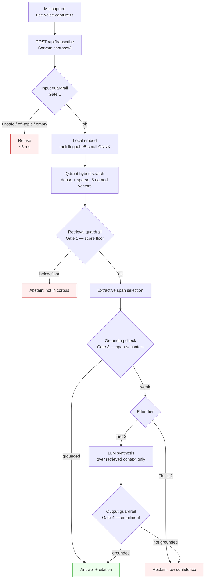

# 02 — Architecture

## The constraint that decides everything

Requirement 3 gives us **200 ms** for retrieval through to final output. A round trip to any
hosted LLM is 300 ms+ before the first token. A round trip to a hosted embedding API is
100–300 ms. A translation call is another 200–400 ms.

So the default answer path can contain **zero network calls after the transcript arrives**.
That single rule kills three otherwise-reasonable designs:

| Tempting design | Why it dies |
| --- | --- |
| Translate the Hindi query to English, search a better English index | +200–400 ms network hop |
| Call OpenAI/Anthropic/Sarvam embeddings for the query vector | +100–300 ms network hop |
| Generate every answer with an LLM | +300 ms TTFT minimum, usually 600 ms+ |

What survives: **local embedding, local-or-loopback vector search, and an extractive
answer**, with the LLM present but off the default path.

## Why extractive answering is legitimate here, not a cop-out

MS MARCO gold answers are largely lifted from the selected passage — visible in the sample
row in [01-dataset.md](01-dataset.md), where the gold Hindi `Answer` is nearly the second
sentence of gold passage #5. This property survives translation because both sides were
translated by the same model.

So a well-tuned retriever plus a light extractive head genuinely answers a large share of
this dataset, and we can *measure* that share against gold rather than assert it. The LLM
becomes an escalation for the cases where extraction is not confident — which is also
exactly where the guardrail wants to intervene.

This unifies requirements 3, 5 and 6 into one mechanism: **a confidence-gated ladder**.

## The ladder

Five rungs, and the four levels already sitting in
[`EffortPanel`](../frontend/src/components/panels/effort-panel.tsx) grew one to hold them.
Each rung is a different **retrieval architecture**, not a different amount of the same one —
the full treatment is in [15-effort.md](15-effort.md).

| Rung | UI label | What runs | Network calls | Budget |
| --- | --- | --- | --- | --- |
| 0 | Lookup | Gate 1 → embed → search → Gate 2. The passages, as they are. | 0 | ~60 ms |
| 1 | Grounded | + answer cache, extractive span, grounding check | 0 | **< 200 ms** |
| 2 | Deep | + hybrid retrieval, rerank, LLM synthesis, Gate 4 | 1 | ~1 s |
| 3 | Corrective | + relevance grading, query rewrite, one re-retrieval | 3–6 | ~5 s |
| 4 | Adaptive | + routing before retrieval, capped repair loop | 4–8 | ~10 s |

**Rung 1 is the default and is what the 200 ms claim refers to.** Rungs 2 and up deliberately
exceed it, are measured against their own budget, and report it as `budgetMs` on every answer
rather than hiding behind the fast tier's number. See [04-latency.md](04-latency.md) for how
this is presented.

The rung is a **ceiling, not a floor**: it says how far the pipeline may escalate, never how
far it must. A question the answer cache already holds costs one local embedding at rung 4, and
a rung whose stages are unavailable falls through to the rung below rather than failing — which
is why every response carries `mode` (asked for) beside `tier` (what answered). A query can also
terminate at any rung by **abstaining** — see [06-guardrails.md](06-guardrails.md).

## End-to-end flow



The offline half — download, flatten, dedup, chunk, embed, index — is covered in
[03-chunking.md](03-chunking.md) and runs once, not per query.

## Component choices

### Speech-to-text — Sarvam `saaras:v3` ✅ already built

[`frontend/src/app/api/transcribe/route.ts`](../frontend/src/app/api/transcribe/route.ts) proxies to
`api.sarvam.ai/speech-to-text` with `language_code=unknown` so Saaras detects the language
itself. The key stays server-side.

Two constraints already handled there and worth not regressing: the REST endpoint caps at
30 s per request, and Sarvam matches content types exactly, so the `;codecs=opus` that
`MediaRecorder` emits must be stripped.

**STT is outside the 200 ms budget.** It is a network call to a third party, typically
500 ms–1.5 s, and no architecture of ours changes that. [04-latency.md](04-latency.md)
defines the measurement boundary explicitly and reports full wall-clock separately so this
is disclosed rather than buried.

The detected language code (`hi-IN`, `ta-IN`, …) flows downstream as a **routing key** — it
selects which language index to search and is a payload filter in Qdrant.
[`languageName()`](../frontend/src/lib/languages.ts) already maps these for display.

### Embedding — `intfloat/multilingual-e5-small`, local ONNX

384 dimensions, ~118M parameters, genuinely multilingual including Indic scripts. Run
in-process via `@huggingface/transformers` on `onnxruntime-node`.

Chosen because it is the smallest model that handles Devanagari, Tamil and Bengali script
well. `bge-m3` retrieves better but is 1024-dim and far heavier — a candidate for the
offline index only if we can afford the query-time cost, which we probably cannot.

Rules that come with e5: prefix queries with `query: ` and passages with `passage: `. Getting
this wrong silently degrades recall by a lot.

**Load once at boot, never per request.** Next 16's `instrumentation.ts` exports a
`register()` that runs once per server instance and must complete before the server accepts
traffic — exactly the hook we want:

```ts
// src/instrumentation.ts
export async function register() {
  const { warmEmbedder } = await import("@/lib/rag/embed");
  const { warmIndex } = await import("@/lib/rag/store");
  await Promise.all([warmEmbedder(), warmIndex()]);
}
```

Without this, the first query pays model-load cost and P100 is meaningless.

### Vector DB — Qdrant, local

Running locally over loopback: ~1–3 ms, which fits the budget. Chosen over an embedded
library because it earns its keep on requirement 2:

- **Named vectors** — all five chunking strategies live in one collection, queryable
  independently or together. This is the cleanest possible answer to "multiple chunking
  strategies."
- **Sparse vectors** — BM25-style lexical hybrid alongside dense, in one query. Matters a
  lot for `NUMERIC` and `ENTITY` queries where exact tokens beat semantics.
- **Payload filtering** — `language`, `query_type`, `strategy`, `doc_id` become filters,
  which is what "metadata-aware chunking" actually means at query time.
- It is unambiguously "a vector DB", which the brief asks for by name.

Enable int8 scalar quantisation: ~4× memory reduction, and rescoring keeps recall close to
full precision. See the memory numbers in [01-dataset.md](01-dataset.md).

Fallback if Qdrant setup eats too much time: `hnswlib-node` in-process. Faster (no loopback
hop) but loses hybrid search and named vectors, which weakens the requirement-2 story.

### Answer synthesis

**Tier 1–2, extractive.** Score sentences within the top passages against the query using
the embeddings we already computed, pick the best window, return it with a citation back to
`doc_id` / `query_id`. No model call. Single-digit milliseconds.

**Tier 3, LLM.** A single structured call over retrieved context only, with the context
pinned in the prompt and the model instructed to answer strictly from it. Output is a typed
object, not free text — see [05-harness.md](05-harness.md).

## Where the code goes

```
src/
  instrumentation.ts              # register(): warm embedder + index before traffic
  proxy.ts                        # rate limit, request id  (Next 16: NOT middleware.ts)
  app/api/
    transcribe/route.ts           # ✅ exists — Sarvam STT
    ask/route.ts                  # new — the RAG entry point
    metrics/route.ts              # new — latency percentiles for the analytics panel
  lib/rag/
    embed.ts                      # ONNX session, query/passage prefixes, warmEmbedder()
    store.ts                      # Qdrant client, named-vector search, warmIndex()
    chunk.ts                      # the five strategies (also used offline)
    extract.ts                    # sentence scoring + span selection
    guardrails.ts                 # the four gates
    harness.ts                    # stage runner, retries, timing, escalation
    types.ts                      # AskRequest / AskResponse / StageTiming
  lib/conversation.tsx            # ✅ exists — Turn.reply is the slot the answer lands in
scripts/
  ingest.ts                       # parquet → chunks → embeddings → Qdrant
  evaluate.ts                     # recall@k, abstention F1, latency percentiles
docs/                             # you are here
```

Two Next 16 specifics that will bite if ignored:

- **`middleware.ts` is deprecated and renamed to `proxy.ts`.** Same functionality, different
  file and export name. Codemod: `npx @next/codemod@canary middleware-to-proxy .`
- **The edge runtime is deprecated.** `nodejs` is the default, so the `export const runtime`
  line is unnecessary. It is also mandatory for us — `onnxruntime-node` cannot run on edge.

## The API contract

One endpoint, typed both ways. The `timings` block is not decoration — it is the raw
material for requirement 4, and having the server report per-stage numbers is what makes
[04-latency.md](04-latency.md) reportable at all.

```ts
type AskRequest = {
  transcript: string;
  languageCode: string | null;   // from Sarvam, e.g. "hi-IN"
  effort: 0 | 1 | 2 | 3;         // EffortPanel index
  requestId: string;
};

type AskResponse = {
  status: "answered" | "abstained" | "refused";
  answer: string | null;
  citations: Array<{ docId: string; strategy: ChunkStrategy; score: number }>;
  confidence: number;            // 0-1, drives the ladder
  tier: 0 | 1 | 2 | 3;           // which tier actually produced this
  reason: string | null;         // why we abstained or refused — user-facing
  timings: {
    guardIn: number; embed: number; search: number;
    rerank: number | null; extract: number; generate: number | null;
    guardOut: number; total: number;
  };
};
```

`status: "abstained"` is a **success**, not an error. The UI must render it as a real answer
("I don't have that in my sources"), not an error state. That distinction is the whole point
of requirement 6.

## What this buys us against the requirements

| Requirement | How the architecture answers it |
| --- | --- |
| 1 — STT | Sarvam `saaras:v3`, already wired, auto language detection |
| 2 — chunking | Five strategies as Qdrant named vectors + hybrid sparse/dense + payload filters |
| 3 — 200 ms | Zero network calls on the default tier; local ONNX embed, loopback search, extractive answer |
| 4 — analytics | Per-stage `timings` on every response, aggregated by `scripts/evaluate.ts` |
| 5 — harness | Typed stages with retries, timeouts, escalation and structured I/O — [05-harness.md](05-harness.md) |
| 6 — guardrails | Four gates, scored against ~39% labelled unanswerable queries — [06-guardrails.md](06-guardrails.md) |

## Open decisions

These need a call before Phase B in [08-build-plan.md](08-build-plan.md):

1. **Do we ship Tier 3 at all?** It cannot meet 200 ms. Including it and reporting honestly
   shows range; excluding it keeps a cleaner latency story. Recommendation: include it, default
   to Tier 1, report both.
2. **One language or two?** Hindi alone is safe. Adding Tamil or Bengali enables the
   cross-lingual `query_id` demo but roughly doubles ingest time.
3. **Cross-encoder for Tier 2.** Only worth it if a small multilingual reranker runs in
   under ~30 ms on CPU. Measure before committing.
