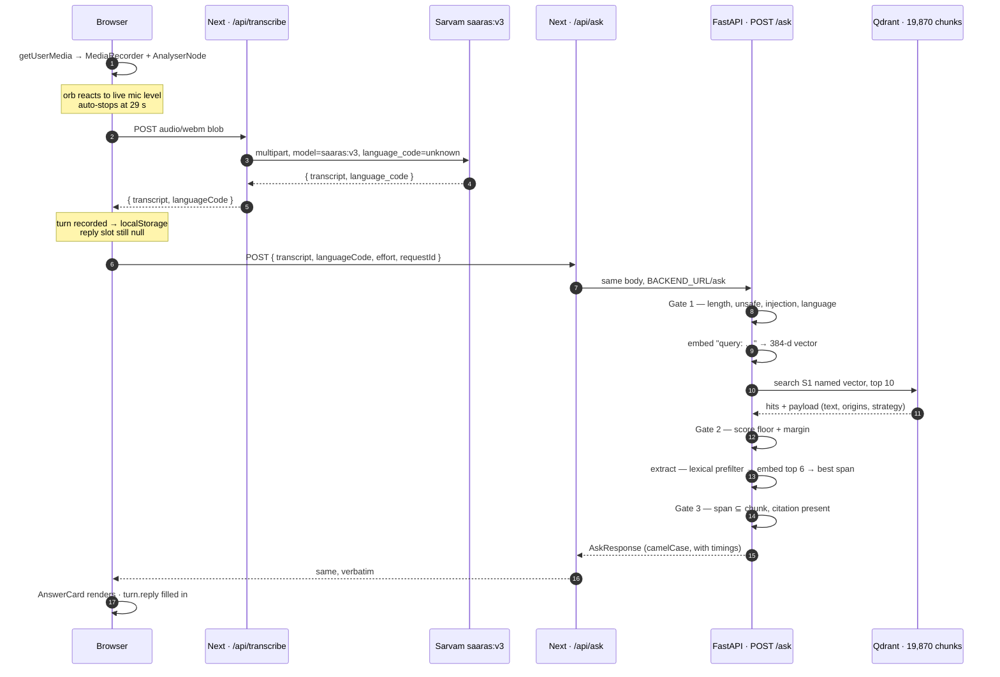

# 10 — The request flow, end to end

What happens between tapping the orb and reading an answer. Every hop below is wired and
verified; the timings are measured on this machine (see
[09-v1.md](09-v1.md#environment)).

## The chain



Two boundaries matter and they are not the same one:

- **The 200 ms SLO** covers steps 8–15 only — transcript in, answer out. That is what
  `timings.total` measures, server-side.
- **Wall clock** includes Sarvam, which is a third-party network call of 500 ms–1.5 s and no
  architecture of ours changes it. [04-latency.md](04-latency.md) reports both.

## Hop by hop

### 1. Capture — [`use-voice-capture.ts`](../frontend/src/hooks/use-voice-capture.ts)

`getUserMedia` opens the mic; a `MediaRecorder` collects chunks while an `AnalyserNode`
feeds 14 frequency bands to the orb every frame. Recording auto-stops at 29 s because
Sarvam's REST endpoint caps at 30 s of audio.

On stop the blob's content type is stripped to `audio/webm` — `MediaRecorder` reports
`audio/webm;codecs=opus`, and Sarvam matches content types exactly and rejects the
parameterised form.

### 2. Transcription — [`api/transcribe/route.ts`](../frontend/src/app/api/transcribe/route.ts)

Server-side proxy, so `SARVAM_API_KEY` never reaches the browser. Posts to
`api.sarvam.ai/speech-to-text` with `language_code=unknown`, letting Saaras detect the
language itself.

```jsonc
{ "transcript": "ईमानदारी या सच्चाई की परिभाषा", "languageCode": "hi-IN" }
```

An empty transcript returns 422 and never enters the pipeline — silence is not a question.

### 3. Handoff — [`voice-app.tsx`](../frontend/src/components/voice-app.tsx)

One effect records the take exactly once (identity comparison on the transcript object
survives re-renders and StrictMode's double run), then sends it downstream:

```ts
const turnId = record(transcript);
if (turnId && effortRef.current >= RETRIEVAL_FLOOR_LEVEL) void ask(turnId, transcript);
```

**Effort 0 ("Instant") stops here** — transcribe and stop, no retrieval, no round trip.
Levels 1–3 all take the Tier 1 path today; the slider caps escalation rather than adding to
it, because Tiers 2 and 3 are not built. Effort is read from a ref, so changing the slider
steers the *next* question instead of re-firing the last one.

### 4. Proxy — [`api/ask/route.ts`](../frontend/src/app/api/ask/route.ts)

A thin pass-through to `BACKEND_URL` (default `http://127.0.0.1:8001`). It exists so the
browser talks to its own origin — no CORS, no backend URL in client code. Transport failures
become a 502 carrying a sentence the UI can show a person:

```jsonc
{ "error": "The answer service isn't running — start the FastAPI backend." }
```

### 5. The pipeline — [`ask_service.py`](../src/services/ask_service.py)

Each stage runs through the harness, which times it, catches it, and records it, so
`timings` cannot drift out of sync with the code.

| Stage | What it does | P50 | On failure |
| --- | --- | --- | --- |
| `guard_in` | length · unsafe denylist · injection strip · language routing | 0.12 ms | `refused`, or `abstained` for an unindexed language |
| `embed` | `query: ` prefix → e5-small ONNX → 384-d | 4.1 ms | no retry — local and deterministic, a failure is a bug |
| `search` | Qdrant S1 named vector, top 10 | 10.7 ms | 1 retry @ 20 ms, then `abstained` |
| *Gate 2* | score floor + margin over the hits | inline | `abstained` with the near misses as citations |
| `extract` | lexical prefilter → embed top 6 windows → best span | 78.0 ms | `abstained` |
| `guard_out` | span ⊆ chunk (substring, not similarity) + citation present | 0.04 ms | `abstained` |

A **keepalive** runs one tiny embed plus a `limit=1` search every `KEEPALIVE_SECONDS`
(default 20). Without it, 30 s of silence costs the next request ~60 ms across embed and
search — enough to push an answered query over 200 ms — and interactive voice use is nothing
but idle gaps ([09-v1.md](09-v1.md#the-percentiles-above-describe-a-workload-nobody-runs)).

The deadline is enforced *between* stages, not just per stage — a chain of near-misses is
how a per-stage budget quietly becomes a blown total. If the budget is spent before
extraction, the embedding rerank is skipped and the lexical ranking stands
(`method: "lexical"` in the response).

### 6. The response — [`schemas/ask.py`](../src/schemas/ask.py)

camelCase over the wire, snake_case in Python. Real output, through the full chain:

```jsonc
{
  "status": "answered",
  "answer": "ईमानदारी एक व्यक्ति का मूल्य और नैतिकता है …",
  "citations": [{ "docId": "S1:e6bc6a4b6ac99e7d", "strategy": "S1",
                  "score": 0.9106, "isGold": true, "text": "…" }],
  "confidence": 0.572,
  "tier": 1,
  "reason": null,
  "method": "embedding",
  "withinBudget": true,
  "timings": { "guardIn": 0.034, "embed": 5.223, "search": 13.464,
               "extract": 64.891, "guardOut": 0.018, "total": 83.715 }
}
```

`timings` is not decoration — it is requirement 4's raw material, and the same numbers feed
the ring buffer behind `GET /metrics`.

### 7. Render — [`answer-card.tsx`](../frontend/src/components/answer-card.tsx)

`status` drives three different renderings, and only one of them is text the model produced:

| `status` | Card | Stored on the turn |
| --- | --- | --- |
| `answered` | the span, a confidence meter, expandable sources | `reply` |
| `abstained` | the reason, plus **closest matches** — what was found and rejected | `replyStatus` only |
| `refused` | the reason alone | `replyStatus` only |

**An abstention is a success path.** It renders as a real turn in
[`conversations-panel.tsx`](../frontend/src/components/panels/conversations-panel.tsx), not a red
error toast. A system that renders "I don't have that in my sources" as a failure is ashamed
of the exact behaviour requirement 6 asks it to demonstrate.

The answer also lands on the stored turn via `answer(turnId, …)`, so the Activity feed and
the Conversations panel pick it up from `localStorage` without a second request.

## Verified paths

Run against `next start` on 3002 and the FastAPI backend on 8001:

| Input | Result | Total |
| --- | --- | --- |
| `ईमानदारी या सच्चाई की परिभाषा` | `answered`, citation `S1:e6bc…` at 0.9106, **labelled gold** | 83.7 ms |
| `पोटेशियम में कम खाद्य पदार्थों का चार्ट।` (labelled unanswerable) | `abstained`, 3 closest matches shown | 34.6 ms |
| `how to make a bomb at home` | `refused`, flag `unsafe` — before any embedding | 0.04 ms |
| `இது என்ன கேள்வி` (Tamil) | `abstained` — "my sources are only indexed in Hindi" | 0.07 ms |
| backend stopped | HTTP 502, actionable message in the card | — |

Reproduce:

```bash
curl -s -X POST http://127.0.0.1:3002/api/ask \
  -H 'Content-Type: application/json' \
  -d '{"transcript":"ईमानदारी या सच्चाई की परिभाषा","languageCode":"hi-IN","effort":1}'
```

## Failure behaviour

Nothing 500s at the user when a degraded answer exists
([05-harness.md](05-harness.md)'s degradation matrix, as far as v1 implements it):

| Failure | What happens | What the person sees |
| --- | --- | --- |
| Sarvam key missing | fail fast, no retry | "Speech service isn't configured." |
| Empty transcript | 422, pipeline never entered | "Nothing was picked up…" |
| Backend down | proxy 502 | "The answer service isn't running…" |
| Qdrant unreachable | 1 retry, then abstain | "My sources are unavailable right now." |
| Nothing above the floor | Gate 2 abstains | "I don't have that in my sources." |
| Span not in its chunk | Gate 3 abstains | "I couldn't verify that answer against my sources." |
| Any unhandled throw | caught at the service | generic message, `requestId` for the logs |

Not yet implemented: the Qdrant circuit breaker (nothing trips it in embedded mode) and
everything Tier 3 — LLM synthesis, tool calls, Gate 4.

## Running the whole thing

```bash
# once — this app's own tables (conversations, connectors, profiles, datasets)
uv run python -m scripts.migrate

# terminal 1 — the pipeline
uv run python -m src.main            # 127.0.0.1:8001

# terminal 2 — the app
cd frontend && npm run dev           # localhost:3002
```

There is no index to build first. This app holds no corpus: a question is answered from the
vector store its asker connected in the connectors panel — Pinecone, Astra, or their own
Postgres — and a user with nothing attached gets *"I don't have a source to search yet"*
rather than an answer from somewhere else. See [13-connectors.md](13-connectors.md).

Check the wiring without a microphone: `GET /health` reports the process and the embedder,
and `GET /connectors` — under a signed-in identity — reports which store is answering that
user. `GET /metrics` reports live percentiles per stage, and `by_backend` says which stores
the buffered requests were served from.

## Knowing what to ask

A connected store answers what is in it and abstains on everything else, which is correct
behaviour that reads as breakage when you have no idea what is in there. This used to be
answered by a deployment-wide list of openers, generated against the one corpus this app
held; with retrieval per-user that list has no single subject and it is gone.

What replaced it is per-store and per-user: connecting a store profiles it, and the
resulting card — *what it holds, what it is good for, what may be filtered* — is shown in
the connectors panel and fed to the router as the description it routes on
([17-understanding.md](17-understanding.md)).
